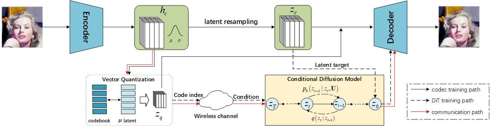

# Posterior-Conditioned Latent Diffusion for Discrete Transmission and Continuous Reconstruction in Generative Semantic Communication

## Abstract
Generative semantic communication provides a promising paradigm for semantic transmission by leveraging learned generative priors to reconstruct semantically consistent content under communication constraints. For practical digital transmission, vector quantization (VQ) provides a natural interface between learned semantic representations and conventional digital communication systems.

However, discretizing a continuous semantic latent with a finite codebook introduces discrete-to-continuous latent ambiguity, while channel impairments further introduce uncertainty about the transmitted codeword indices. To jointly address these two challenges, we propose a soft-posterior-conditioned latent diffusion framework that bridges discrete semantic transmission and continuous generative reconstruction.

Discrete VQ indices are transmitted over the digital channel, while the corresponding continuous latent serves as the receiver-side generative reconstruction target. Bayesian soft demodulation produces position-wise codeword posteriors, which are summarized into compact posterior-aware condition tokens to guide a diffusion transformer (DiT). By combining observation-derived soft evidence with a learned continuous-latent prior, the proposed receiver accounts for channel-induced codeword uncertainty and generates a plausible continuous latent consistent with the received evidence.

Experiments over AWGN and Rayleigh fading channels demonstrate improved perceptual reconstruction quality compared with VQ-based and diffusion-based baselines while maintaining competitive distortion performance.

  

